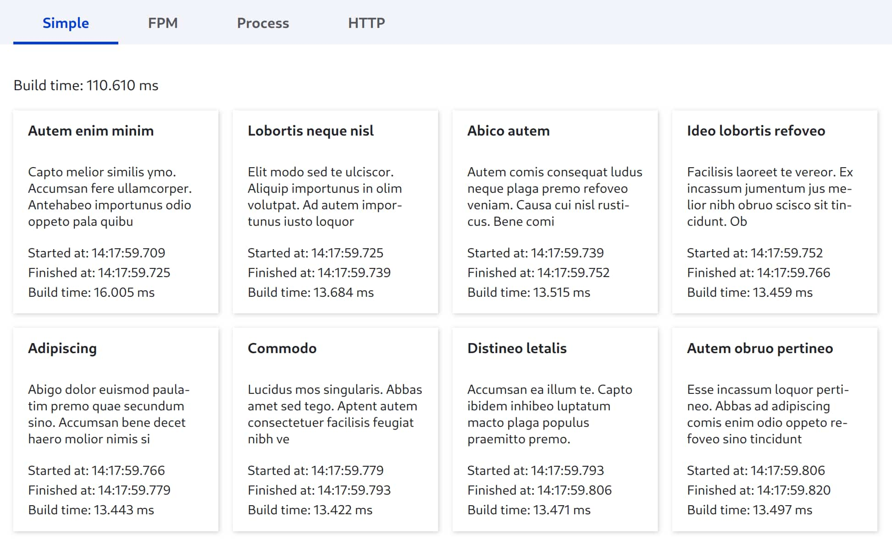

# Sample Catalog Module

## Introduction

The **Sample Catalog** module provides a sandbox environment for testing and analyzing the performance of building content in Drupal. It offers configurable stress-testing settings and a sample catalog with product panes to evaluate the impact of various optimization techniques. This module is designed for developers who want to understand and experiment with Drupal's performance under different conditions.



## Usage

- **Configuration page**: `/admin/config/development/sample-catalog`
- **Catalog page**: `/catalog`

The catalog is a collection of panes built with plugins called `ProductPaneBuilder`. The module ships with a few builders that demonstrate different approaches for building content in Drupal.

## Built-in Builders

Currently, there is no UI for configuring pane builder plugins. Use `settings.php` as described below.

### 1. Simple

This builder creates content in a single thread, which is the typical approach for most Drupal sites.

```php
$build = [];
foreach ($products as $product) {
  $build[] = $this->build($product);
}
```

#### Configuration

No options.

### 2. FPM

The FPM plugin relies on the [Fast CGI Client](https://github.com/hollodotme/fast-cgi-client)
and allows you to build panes in background workers without requiring any extra extensions.

To get the most out of this plugin, make sure you configure the PHP-FPM pool with
a sufficient number of workers.

#### Configuration

```php
$settings['sample_catalog']['fpm']['server_address'] = 'tcp://php:9000';
// Unix sockets are also supported.
$settings['sample_catalog']['fpm']['server_address'] = 'unix:///var/run/php-fpm.sock';
```

### 3. Process

This builder creates each pane in a separate PHP CLI process.

#### Configuration

No options.

### 4. HTTP

This builder delegates the construction of panes to an external HTTP server. The server must
provide the following endpoint:

```
Request: GET /product/{product_id}
Response: Serialized render array for the product pane
```

Although the module itself provides such an endpoint (`/sample-catalog`), it's recommended
to configure a separate multi-threaded application server that boots Drupal once and stays
in memory (RoadRunner, FrankenPHP, etc.).

#### Configuration

```php
$settings['sample_catalog']['http']['base_uri'] = 'http://localhost:8080/sample-catalog';
```
